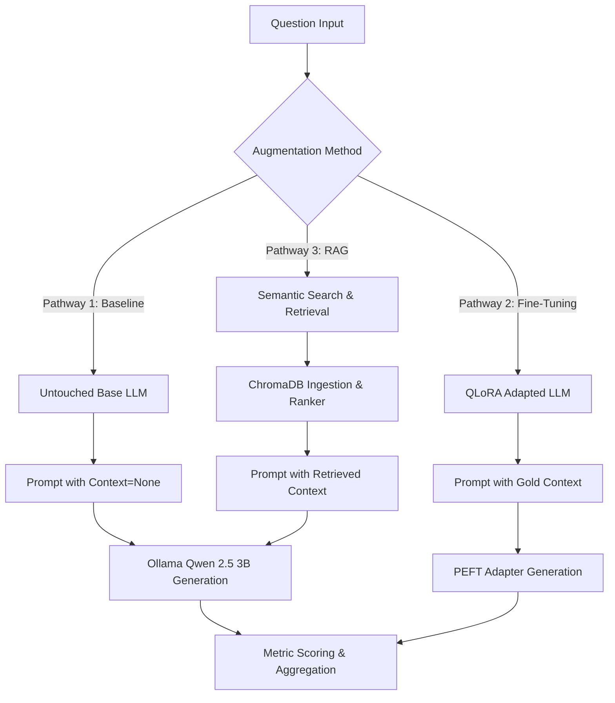

# Comparative Study: LLM Fine-Tuning vs. Retrieval-Augmented Generation (RAG)

Welcome to the working area for the comparative study of LLM Fine-Tuning versus Retrieval-Augmented Generation (RAG) for domain-specific tasks.

This study systematically evaluates the trade-offs between parameter updates (via QLoRA/LoRA adapter fine-tuning) and contextual augmentation (via ChromaDB semantic retrieval) when adapting a base language model (**Qwen 2.5 3B Instruct**) to domain-specific knowledge.

---

## 🏗️ Core Architecture & Comparison Dimensions

This project implements three distinct inference pathways to build a comprehensive performance matrix:



### 1. Baseline Evaluation
- **Methodology**: Evaluates the base model without any external context or parameter updates.
- **Inference**: The model generates answers using prompt templates where the `context` is empty.
- **Role**: Serves as the lower-bound reference score to measure baseline factual retrieval and hallucination tendencies.

### 2. Fine-Tuning Track (QLoRA)
- **Methodology**: Trains a parameter-efficient adapter utilizing **LoRA/QLoRA** on question-context-answer triples.
- **Optimization**: Configured to fit within low-VRAM constraints (e.g., RTX 4050 6GB) using 4-bit quantization (`bitsandbytes`), gradient checkpointing, small micro-batch sizes (1), and gradient accumulation (8).
- **Inference**: The fine-tuned PEFT adapter is loaded dynamically, and generation is fed the gold (original) context.

### 3. RAG Track (ChromaDB + Ollama Embeddings + Reranker)
- **Methodology**: Chunks and indexes the document corpus in a vector store.
- **Stack**:
  - **Vector DB**: ChromaDB (Cosine distance space).
  - **Embeddings**: Local Ollama-hosted embedding models (`nomic-embed-text-v2-moe`).
  - **Reranker**: Optional cross-encoder reranking model (`BAAI/bge-reranker-base`) to reorder the top - $K$ candidate passages.
- **Inference**: Queries are embedded, matched with relevant chunks, reranked, and formatted into the instruction prompt template before being generated by the base LLM.

---

## 📊 Supported Datasets

The study implements ingestion pipelines for three diverse datasets, testing different aspects of factual recall, generation quality, and system robustness:

1. **SQuAD v2.0 (Extractive & Abstention QA)**
   - **Characteristics**: Passages and question-answer pairs compiled from Wikipedia.
   - **Abstention Metric**: SQuAD v2.0 contains questions that cannot be answered from the passage. The system evaluates the model's ability to abstain by returning `"no answer"` (fine-tuned) or `"I don't know."` (RAG).
   - **Source Files**: Located in `data/raw/squad/` (`train-v2.0.json` and `dev-v2.0.json`).

2. **RecipeNLG (Structured Text Generation)**
   - **Characteristics**: Large recipe generation corpus containing titles, ingredients, and cooking steps.
   - **Task**: Evaluates ability to translate structured lists of ingredients (inputs) into natural cooking directions (targets).
   - **Source File**: `data/raw/recipenlg/recipes.csv`.

3. **Custom Docs (Corporate/Technical Documentation)**
   - **Characteristics**: Local markdown, text, or documentation corpora chunked recursively.
   - **Task**: Evaluation of document navigation, system configuration notes, and volatile factual lookups.
   - **Source Directory**: `data/raw/docs/`.

---

## 📂 Project Layout

```text
LLM-finetuning-vs-RAG/
├── .gitignore              # Ignores large model weights, databases, and processed data
├── requirements.txt        # Python package dependencies
├── start.bat               # Bootstrap batch script to run the pipeline end-to-end
├── src/                    # Source code scripts directory
│   ├── __init__.py
│   ├── config.py           # Configuration file - Single Source of Truth
│   ├── common.py           # Shared helper functions, metrics, and Ollama client wrapper
│   ├── download_models.py  # Model downloader and Hugging Face cross-encoder warmer
│   ├── prepare_squad.py    # Standard SQuAD v2.0 json flattener & parser
│   ├── prepare_recipenlg.py# RecipeNLG CSV parser and prompt mapper
│   ├── prepare_docs.py     # Custom document corpus recursive parser and chunker
│   ├── eval_baseline.py    # Runs baseline inference on processed splits
│   ├── finetune_qlora.py   # Training script for LoRA adapters via Hugging Face PEFT/Trainer
│   ├── eval_finetuned.py   # Runs inference using PEFT adapters on local GPU
│   ├── ingest_chroma.py    # Chunks and indexes datasets in ChromaDB collections
│   ├── rag_query.py        # Implements query embedding, retrieve, rerank, and query pipelines
│   ├── eval_rag.py         # Evaluates the RAG pipeline on processed splits
│   ├── score_ragas.py      # Computes RAGAS evaluations and manual-review templates
│   └── aggregate_results.py# Compiles baseline, fine-tuned, and RAG logs into summary reports
├── data/                   # Dataset folders (ignored in git)
│   ├── raw/                # Unmodified dataset sources
│   └── processed/          # Train, validation, and test splits (JSONL format)
├── models/                 # Model checkpoints (ignored in git)
│   ├── base/               # Pretrained base weights (if cached locally)
│   └── finetuned/          # Fine-tuned adapter configurations and weights
├── chroma_db/              # Persistent ChromaDB vector databases (ignored in git)
├── results/                # Raw JSONL logs with generation details & exact metric scores
└── eval_reports/           # Structured summary tables and CSV files for qualitative review
```

---

## ⚙️ Configuration (Single Source of Truth)

All global settings are defined in `src/config.py`. Centralizing these constants prevents discrepancies between evaluation pipelines:

- **Model Selection**: Base LLM (`BASE_MODEL`), Embedding Model (`EMBED_MODEL`), and Reranking Model (`RERANKER_MODEL`).
- **Generation Parameters**: Inference `TEMPERATURE` and `MAX_TOKENS`.
- **System Prompts**: Standard instruction prompt templates (`PROMPT_TEMPLATE`).
- **RAG parameters**: `CHUNK_SIZE`, `CHUNK_OVERLAP`, and `TOP_K` retrieve values.
- **Splits**: Train (`TRAIN_RATIO`), validation (`VAL_RATIO`), and test (`TEST_RATIO`) proportions.

---

## 🚀 Getting Started & Execution

### Prerequisites

1. **System**: NVIDIA GPU (CUDA-compatible) with drivers installed.
2. **Environment**: Python 3.10+ installed.
3. **Ollama Server**: Install [Ollama](https://ollama.com) and ensure the daemon is running locally (`ollama serve`).

---

### Method A: Automated Run (Recommended)
You can run the entire pipeline end-to-end using the bootstrap batch file:
```cmd
start.bat
```
This script will:
1. Create a Python virtual environment (`.venv`) and upgrade `pip`.
2. Install all dependencies from `requirements.txt`.
3. Auto-generate sample local documents and recipes if none exist.
4. Pull the Qwen base model and Nomic embedding model to Ollama, and cache the Hugging Face reranker.
5. Prepare SQuAD, RecipeNLG, and Custom Docs datasets (splitting them into train/val/test splits).
6. Run the baseline, QLoRA training, and RAG ingestion + evaluation modules for each dataset.
7. Run qualitative/quantitative scorers and aggregate metrics into summary CSVs.

---

### Method B: Manual Step-by-Step Run

#### 1. Setup Environment
```cmd
python -m venv .venv
call .venv\Scripts\activate
pip install -r requirements.txt
```

#### 2. Pull and Warm Up Models
Ensure Ollama is running, then pull the LLM & Embedding models and download HF CrossEncoders:
```cmd
python src/download_models.py --pull --warmup_hf
```

#### 3. Parse and Prepare Datasets
Convert raw datasets into cleaned JSONL splits:
```cmd
python src/prepare_squad.py
python src/prepare_recipenlg.py --input_path data/raw/recipenlg/recipes.csv
python src/prepare_docs.py --input_dir data/raw/docs
```

#### 4. Run Baseline Evaluations
Evaluate the base model against the frozen test sets:
```cmd
python src/eval_baseline.py --dataset squad
python src/eval_baseline.py --dataset recipenlg
python src/eval_baseline.py --dataset docs
```

#### 5. Fine-Tuning Track
Train the QLoRA adapter on the training splits:
```cmd
python src/finetune_qlora.py --dataset data/processed/recipenlg/train.jsonl --output_dir models/finetuned/recipenlg --epochs 1 --max_length 256 --batch_size 1 --grad_accumulation 1
```
Evaluate the adapter on the test splits:
```cmd
python src/eval_finetuned.py --dataset recipenlg --model_dir models/finetuned/recipenlg --max_new_tokens 128
```

#### 6. RAG Track
Ingest contexts into the vector database:
```cmd
python src/ingest_chroma.py --dataset squad --splits train val --collection_name squad_512
python src/ingest_chroma.py --dataset recipenlg --splits train val --collection_name recipenlg_512
python src/ingest_chroma.py --dataset docs --splits train val --collection_name docs_512
```
Evaluate RAG on the test splits:
```cmd
python src/eval_rag.py --dataset squad --collection_name squad_512
python src/eval_rag.py --dataset recipenlg --collection_name recipenlg_512
python src/eval_rag.py --dataset docs --collection_name docs_512
```

#### 7. Score and Aggregate Results
Generate CSV tables scoring general metrics and prepare files for manual inspection:
```cmd
python src/score_ragas.py --input results\rag_squad.jsonl --dataset squad
python src/score_ragas.py --input results\rag_recipenlg.jsonl --dataset recipenlg
python src/score_ragas.py --input results\rag_docs.jsonl --dataset docs

python src/aggregate_results.py
```

---

## 📈 Evaluation & Ablation Workflows

The codebase is built to support systematic ablation sweeps to study variables in isolation:

### RAG Parameter Sweeps
- **Chunk Size Swings**: Test different chunk sizes (`256`, `512`, `1024` tokens) by specifying the parameters during ingestion and query evaluation:
  ```cmd
  python src/ingest_chroma.py --dataset docs --chunk_size 256 --collection_name docs_256
  python src/eval_rag.py --dataset docs --collection_name docs_256 --chunk_size 256
  ```
- **Top-K Retrieval Swings**: Swap retrieval limits (`3`, `5`, `10`) to identify context-window trade-offs:
  ```cmd
  python src/eval_rag.py --dataset squad --collection_name squad_512 --top_k 10
  ```
- **Reranker Impact**: Measure accuracy/latency delta by omitting the reranking parameter in downstream evaluations.

---

## 📝 Expected Outputs

- **Raw Inference Outputs (`results/`)**:
  JSONL logs with keys including `latency_s`, `input_tokens_est`, `output_tokens_est`, `exact_match`, and `answer_f1`.
- **RAGAS Evaluations (`eval_reports/ragas_*.csv`)**:
  Tabular reports listing token F1, context precision, faithfulness/hallucination, and latency averages.
- **Manual Review Templates (`eval_reports/manual_*.csv`)**:
  Subset templates containing 100 randomly sampled questions with predictions, exact match scores, and blank spaces to evaluate fluency, correctness, completeness, and helpfulness (1–5 scale).
- **Summary Aggregation (`eval_reports/summary_table.csv`)**:
  Comparison summary of baseline, fine-tuned, and RAG techniques categorized across datasets.
